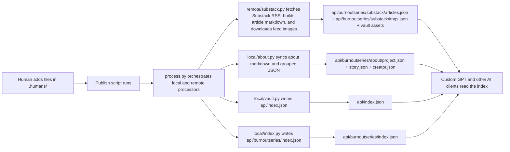

# Burnout Series @Blackaft


This repository is a knowledge base meant for audiences using AI companions to consume content.

Ping [George Kary](https://github.com/geogkary) on Google Chat for help.

Follow on [X](https://x.com/blackaftx) for updates.

## A few words

**BURNOUT** is an experimental project about the process of making a story, with the goal of up-skilling. It includes project updates, author’s notes, behind the scenes and materials and guides. Born out of a passion for exploring multi-disciplinary and cross-functional projects; and, of course, a love of storytelling.

A major aspect of the experiment is the use of AI for research, analysis, retrospectives, and distribution of the knowledge base. Instead of asking audiences to navigate dozens of articles, the series publishes a structured, machine-readable corpus that AI companions and other tools can explore.

## Using this knowledge base

If you're looking to build your own AI setup, point your AI to:

- [Companion Instructions](.agents/docs/prompts/20260805-companion-instructions.md), if you're simply looking to interact with the series.
- [Publisher Instructions](.agents/docs/prompts/20260805-publisher-instructions.md), to update the knowledge base.

Ready to use:

- [ChatGPT](https://chatgpt.com/g/g-6a61ca759b788191babe096fc2c19e58-burnout-series) (Custom GPT)

## Updating it

Under `.humans/`, add any new text files for about material. Use a simple filename such as `georgekary.txt` or `guide.txt`.

Publish the update:

<details>
    <summary>Run the command on the terminal yourself</summary>

```bash
chmod +x .agents/scripts/publish.sh
./.agents/scripts/publish.sh
```
</details>
<details>
    <summary>Prompt your AI to do it</summary>

```markdown
Publish this knowledge base update by running `./.agents/scripts/publish.sh` and following any prompts the script presents. If the script reports an error, stop and show me the complete output instead of trying to work around it.
```
</details>

### How it works

What happens, in order:

1. You add human-authored source files under `.humans/`.
2. `publish.sh` runs the orchestrator in `.agents/scripts/process.py`.
3. The processors move or generate durable assets under `vaults/burnoutseries/`.
4. The API is rebuilt under `api/`, with `api/index.json` as the global registry and `api/burnoutseries/index.json` as the vault-specific entrypoint.
5. The Custom GPT reads `api/burnoutseries/index.json` first, then drills into posts, about text, or images only when needed.



The knowledge base is now designed so AI companions start from `api/burnoutseries/index.json`.

- The index exposes `vault`, including prompt guidance and navigation.
- It exposes grouped `about` and `substack` indexes with `path` plus `items`.
- Post items include `substack_url` for real post links.
- Raw repository content should be derived from `base_url + path + file`.
- Public post links should come from `substack_url`, not guessed website URLs.

---

*Created and maintained together with AI. This software is protected and distributed by the [PolyForm Shield License 1.0.0](LICENSE.md). Badges by [shields.io](https://github.com/badges/shields).*
